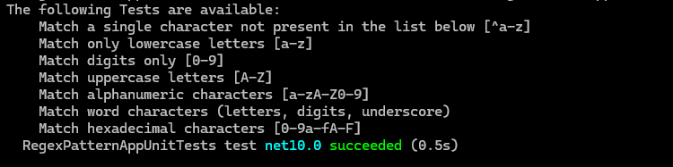
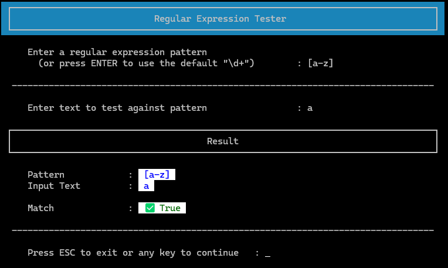
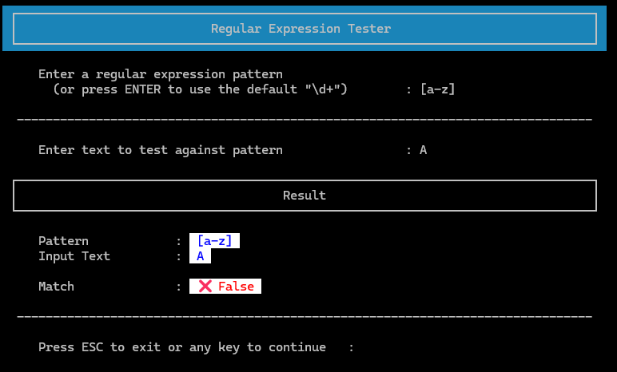

_This README.md file was created with assistance from AI - GitHub Copilot. 
The remaining code was developed without AI support, except where explicitly 
indicated in the code comments._

# Pattern Matching with Regular Expressions

A small console application and unit-test project demonstrating regular-expression pattern testing 
and simple console formatting utilities.

# Files and Folders
```
│   .gitignore
│   DotNetA1Regex.csproj
│   DotNetA1Regex.slnx
│   readme.md
│
├───.github
│   └───workflows
│           dotnet-test.yml
│
├───src
│       AnsiColorCodes.cs
│       Formatting.cs
│       Program.cs
│       Utility.cs
│
└───tests
    └───RegexPatternAppUnitTests
            BasicTests.cs
            RegexPatternAppUnitTests.csproj
```

# Files in this repository 


**_Files are located at the project root (no package declared in source files):_**
* **DotNetA1Regex.csproj**
  * Project file for the console application (targets .NET 10).

* **DotNetA1Regex.slnx**
  * Solution file for opening the project in Visual Studio.

* **.gitignore**
  * Repository ignore rules.

* **readme.md**
  * This documentation file.

* **screenshots/**
  * Folder for screen captures and sample runs.

* **.github/workflows/dotnet-test.yml**
  * GitHub Actions workflow to build and run tests on push/PR. 

**_Source files (under src/):_**

* **src/AnsiColorCodes.cs**
  * ANSI color constants and small helpers for colored console output.

* **src/Formatting.cs**
  * Console formatting helpers used to render test results and menus.

* **src/Program.cs**
  * Console program entry point. Presents interactive options for testing regular-expression patterns 
and delegates to helper utilities.

* **src/Utility.cs**
  * Miscellaneous utilities (input parsing/validation, regex helpers, small reusable functions).

**_Unit tests (under tests/RegexPatternAppUnitTests/):_**

* **tests/RegexPatternAppUnitTests/BasicTests.cs**
  * Unit tests covering core regex-pattern behavior and formatting utilities.

* **tests/RegexPatternAppUnitTests/RegexPatternAppUnitTests.csproj**
  * Test project file used by the test runner.

## Requirements

- .NET SDK: Version 10.0.100
- No external libraries
- ANSI-capable terminal (optional, for colors)

## Usage

This is a console application. Typical usage flows are implemented in `src/Program.cs` and the supporting helpers under `src/` (`Utility.cs`, `Formatting.cs`, `AnsiColorCodes.cs`). Open `src/Program.cs` to see how the program:

- Accepts input and menu choices (interactive mode).
- Uses `Utility` for input parsing, validation, and regular-expression helpers.
- Renders results and menus with `Formatting` (and optional ANSI coloring via `AnsiColorCodes`).

## Build and Run (powershell)

> Restore dependencies 
```
dotnet restore
```

> Build
```
dotnet build
```

> Run
```
dotnet run
```

> Run tests 
```
dotnet test 
```

> List available automated unit tests
```
dotnet test tests/RegexPatternAppUnitTests/RegexPatternAppUnitTests.csproj --list-tests
```


## Usage

Some session screenshots 





## Contact

If you have questions or need further changes, reply here or refer to the course materials.